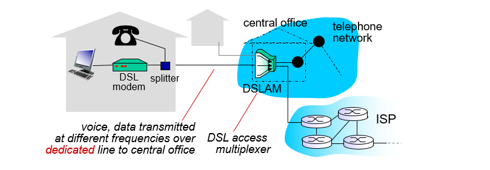
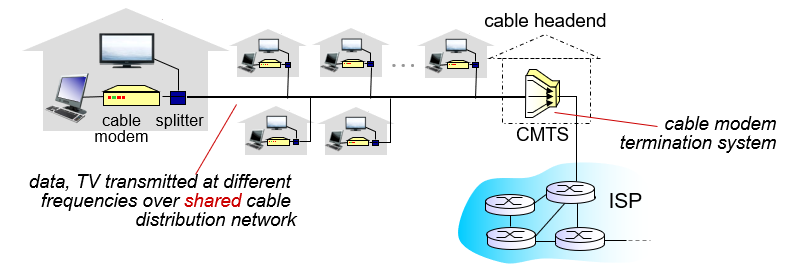
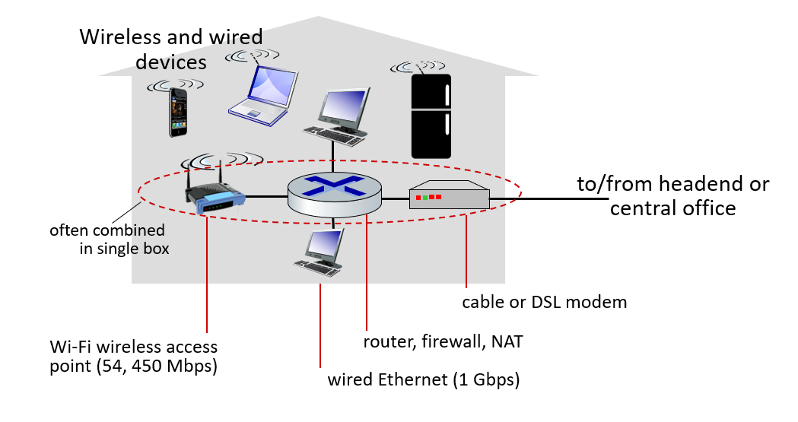
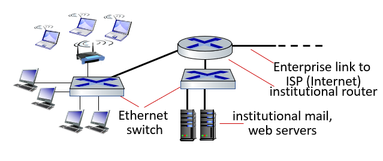
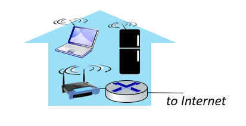
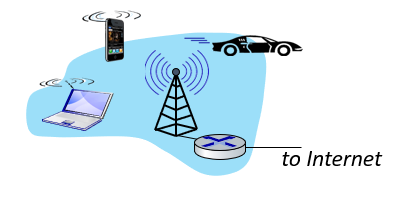

<https://birkhoffg.github.io/blog/posts/networking-what-is-networking/>

## Internet

Internet: "network of networks"

- Interconnected ISPs

Protocols control sending,receiving of messages

- e.g., TCP, IP, HTTP, Skype, 802.11 (WiFi)

Internet standards

- RFC: Request for comments
- IETF: Internet Engineering Task Force
- ISO, IEEE

---

## Internet Structure

Network edge:

- hosts: clients and servers
- servers often in data centers
- access networks, physical media: wired, wireless
  communication links
  
Network core:

- interconnected routers
- network of networks

Connect end systems to edge routers

- residential access nets
- institutional access networks (school, company)
- mobile access networks
- shared or dedicated?

### Access Network: Digital Subscriber Line (DSL)

=

- Use existing telephone line to central office DSLAM.
- dedicated access to central office
- < 2.5 Mbps upstream transmission rate (typically < 1 Mbps)
- < 24 Mbps downstream transmission rate (typically < 10 Mbps)

### Access Network: Cable Network

- Frequency division multiplexing: different channels transmitted in different frequency bands
- HFC: [hybrid fiber coax](https://en.wikipedia.org/wiki/Hybrid_fiber-coaxial) up to 30Mbps
- Network of cable, fiber attaches homes to ISProuter
- homes share network to cable headend

### Access Network: Home Network

### Enterprise Access Networks (Ethernet)

- 10 Mbps,100Mbps,1Gbps, 10Gbps transmission rates
- Today, end systems typically connect into Ethernet switch

### Wireless Access Networks

- Shared wireless access to base station aka "access point"

Wireless LANs (WiFi):

- {: w="40"}
- 11, 54, 450 Mbps rate

Wide-area wireless accesss

- {: w="40"}
- cellular operator, 10's km
- 1 to 10 Mbps
- 3G, 4G, [LTE](https://en.wikipedia.org/wiki/LTE_(telecommunication))

## Host: Sends Packets of Data

Host sending function:

- breaks appilication layer messages into smaller chunks (packets), of length $L$ bits
- transmits packet into access network at transmission rate $R$ 
- **link transmission rate / link capacity / link bandwidth**:

$$
\frac{L \text{ (bits)}}{R\text{ (bits/s)}}
$$

## Physical Media

guided media:

- signals propagate in solid media: copper,fiber,coax

unguided media:

- signals propagate freely
e.g., radio

twisted pair (TP)：

- two insulated copper Wires
- Category 5:100 Mbps1，Gbps Ethernet / Category 6: 10Gbps

Coaxial Cable:

- multiple channels

Fiber optic cable:

- high-speed point-to-point transmission (e.g.,10's-100's Gbps transmission rate)

## Network-core

2 key functions:

- routing
- forwarding

