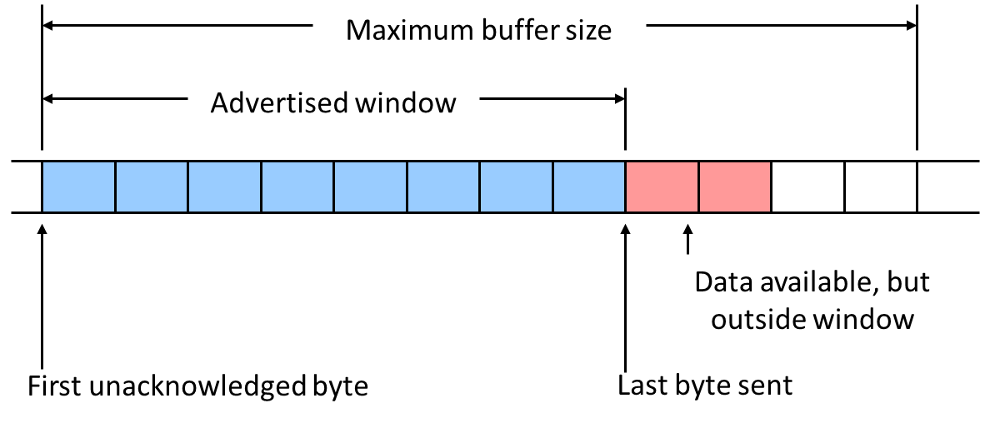
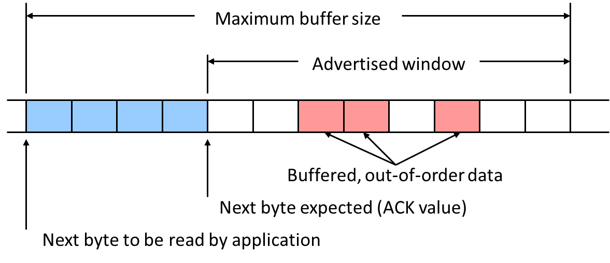
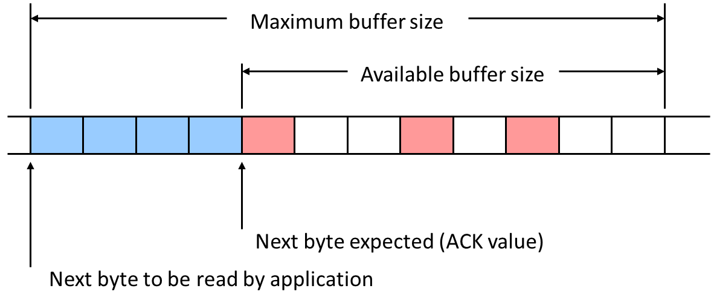
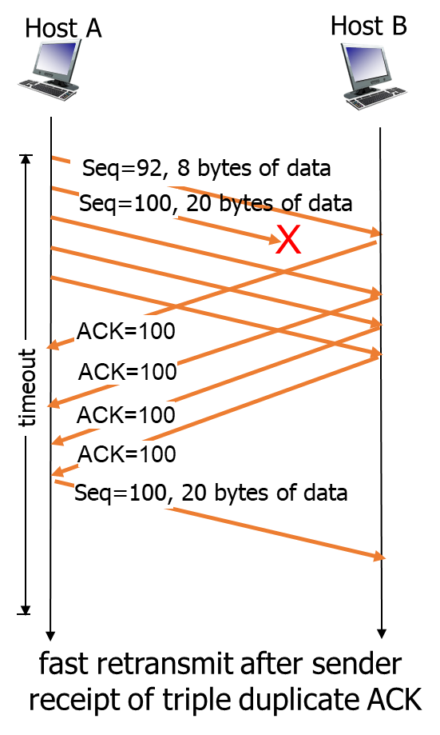
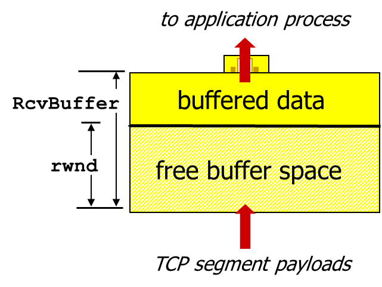
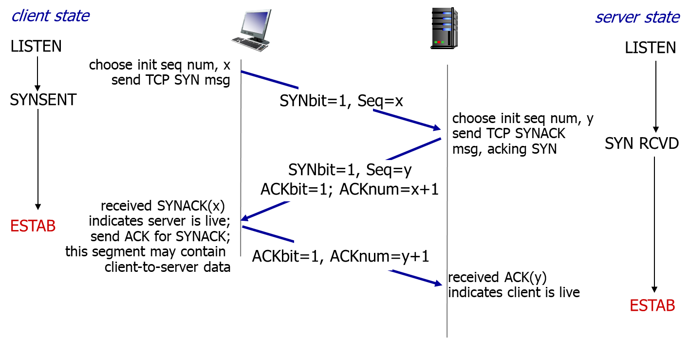
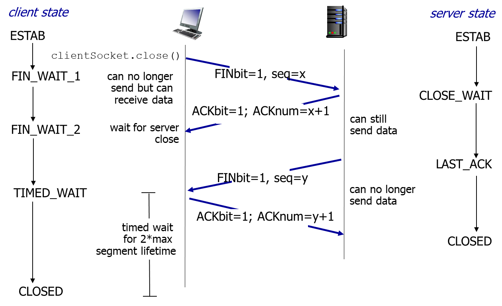

## TCP reliable data transfer

### TCP ACK generation

{: w="400" }

{: w="400" }

{: w="400" }

Arrival of in-order segment with expected seq #. One other segment has ACK pending | Immediately send single **cumulative** ACK, ACKing both in-order segments
Arrival of out-of-order segment higher-than-expect seq. #. Gap detected. | Immediately send **duplicate** ACK, indicating seq. # of next expected byte
Arrival of segment that partially or completely fills gap.|Immediate send ACK, provided that segment starts at lower end of gap
  
### TCP fast retransmit

TCP fast retransmit
: if sender receives 3 ACKs for same data (“triple duplicate ACKs”), resend unacked segment with smallest seq #
: likely that unacked segment lost, so don’t wait for timeout

{: w="300" }

## TCP flow control

flow control
: receiver controls sender, so sender won’t overflow receiver’s buffer by transmitting too much, too fast

- receiver “advertises” free buffer space by including rwnd value in TCP header of receiver-to-sender segments
- sender limits amount of unacked (“in-flight”) data to receiver’s rwnd value
- guarantees receive buffer will not overflow

{: w="300" }

## Connection Management

before exchanging data, sender/receiver “handshake”:

- agree to establish connection (each knowing the other willing to establish connection)
- agree on connection parameters

### TCP 3-way handshake

{: w="700" }

### TCP closing a connection

{: w="700" }
