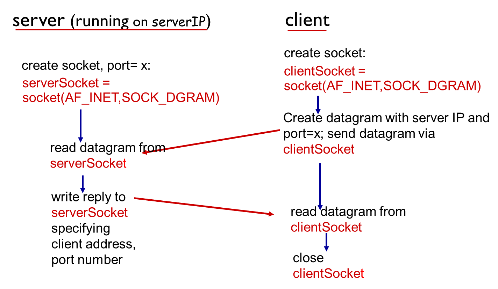
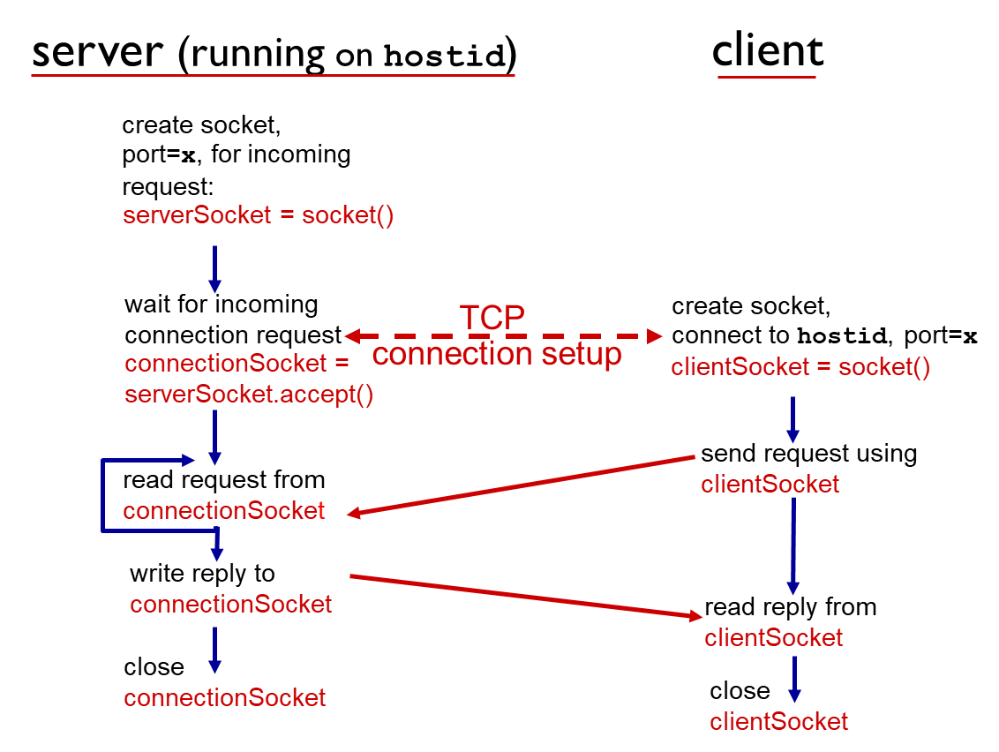
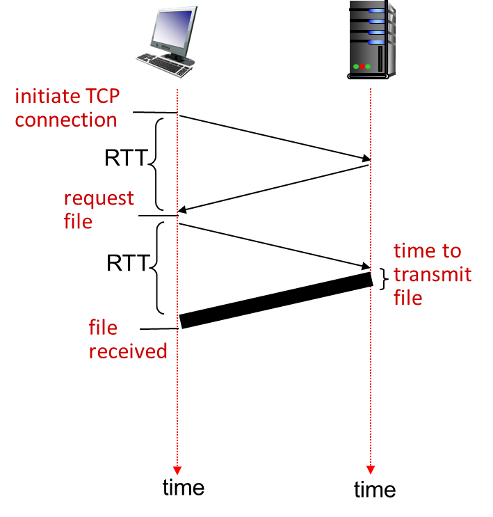
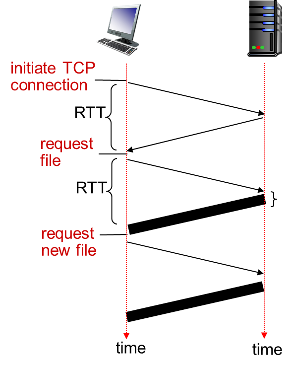
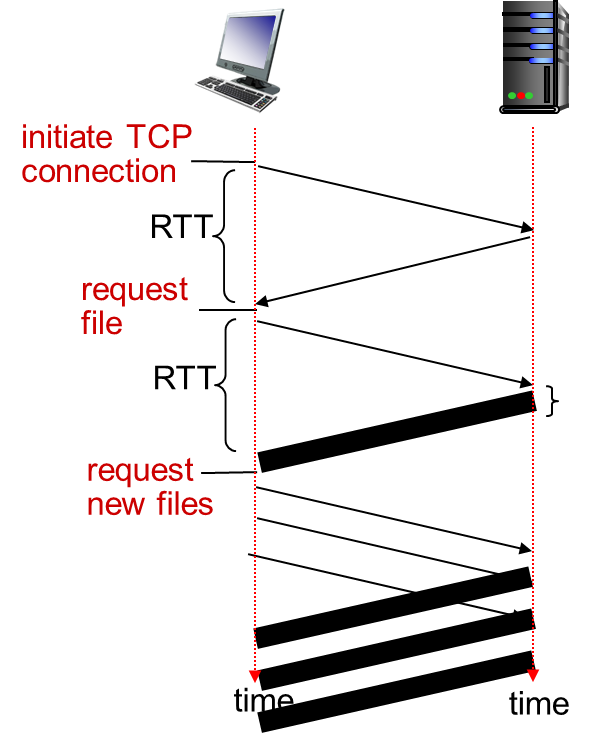
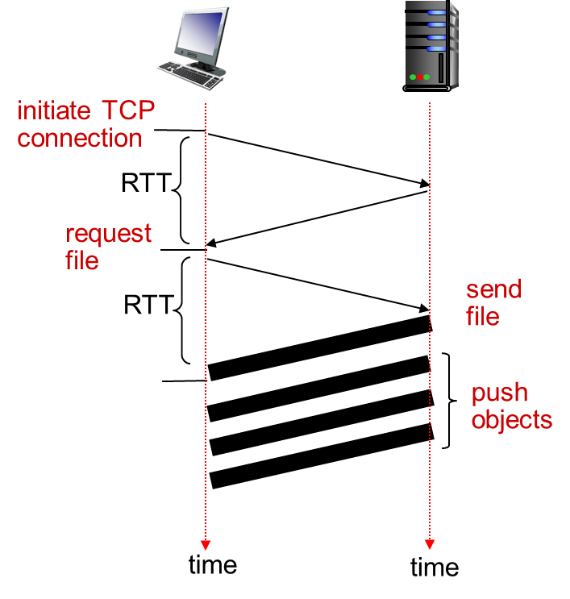
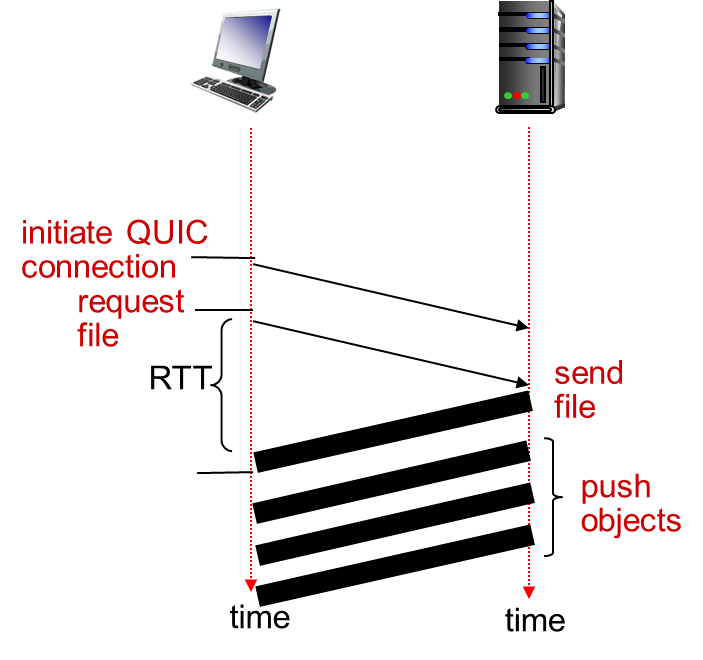
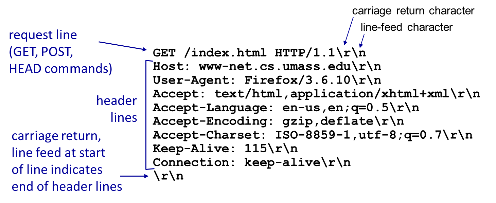
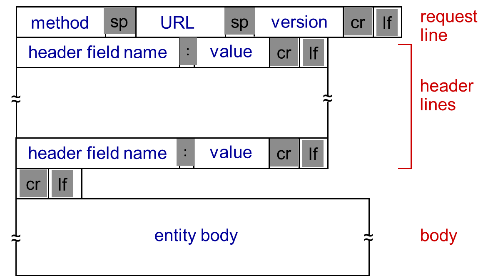
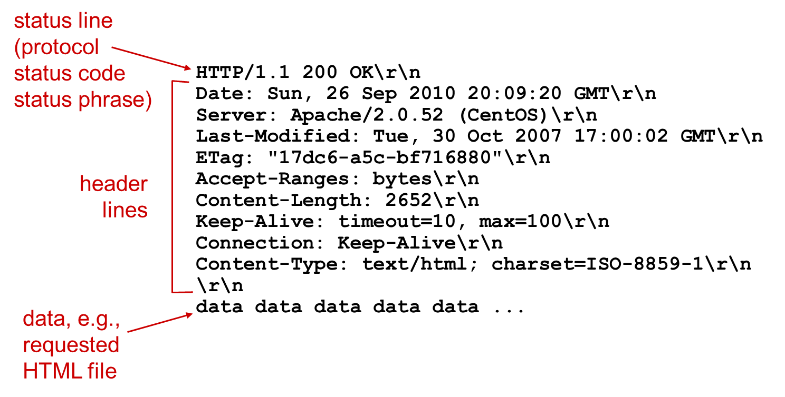

## Internet transport protocols services

### TCP service

- reliable transport
- flow control
  - sender won’t overwhelm receiver
- congestion control
  - throttle sender when network overloaded
- does not provide
  - timing
  - minimum throughput guarantee
  - security
- connection-oriented

### UDP service

- unreliable data transfer between sending and receiving process
- does not provide
  - reliability
  - flow control
  - congestion control
  - timing
  - throughput guarantee
  - security
  - connection setup

### Applications & transport protocols

| Application            | Application Layer Protocol                            | Underlying Transport Protocol |
|------------------------|-------------------------------------------------------|-------------------------------|
| e-mail                 | SMTP [RFC 2821]                                       | TCP                           |
| remote terminal access | Telnet [RFC 854], SSH                                 | TCP                           |
| Web                    | HTTP [RFC 2616]                                       | TCP                           |
| file transfer          | FTP [RFC 959]                                         | TCP                           |
| streaming multimedia   | HTTP (e.g., YouTube), RTP [RFC 1889]                  | TCP or UDP                    |
| Internet telephony     | SIP, RTP, proprietary (e.g., Skype)                   | TCP or UDP                    |
| naming                 | DNS                                                   | UDP (and TCP)                 |

### Socket programming with UDP

- no handshaking
- sender explicitly attaches IP destination address and port # to each packet
- receiver extracts sender IP address and port# from received packet

### Socket programming with TCP

server must

- first be running
- have created socket (door) that welcomes client’s contact

client contacts server by:

- Creating TCP socket, specifying IP address, port number of server process

server TCP creates new socket

- for server process to communicate with that particular client

{: w="700" }
_UDP_

{: w="700" }
_TCP_

---

## Web and HTTP (hypertext transfer protocol)

- each object is addressable by a URL:

{: w="500" }

- use TCP on port 80
- HTTP is stateless: server maintains no information about past client requests

### Non-persistent HTTP

RTT (Round Trip Time): time for a small packet to travel from client to server and back

{: w="300" }
_non-persistent HTTP response time = 2RTT+ file transmission time_

### Persistent HTTP

server leaves connection open after sending response

{: h="700" }

Other Optimizations

### Pipelining

Send several requests at once

{: w="700" }

### HTTP/2

Push resources (send file ahead that clients may request)

{: w="700" }

### QUIC

Eliminate first RTT

{: w="700" }

### HTTP request message

two types of HTTP messages: **request**, **response**.

HTTP request message:

{: w="600" }

{: w="600" }

- `GET` method: input is in `URL` field.
- `POST` method: inpit is in entity body.
- `HEAD` method: asks server to leave requested object out of response
- (HTTP1.1) `PUT` method: uploads file in entity body to path specified in URL field
- (HTTP1.1) `DELETE` method: deletes file specified in the URL field

### HTTP response message

{: w="700" }

code | message | meaning
---|---|---
200 | OK | request succeeded, | requested object later in this msg
301 | Moved Permanently | requested object moved, new location specified later in this msg (Location:)
400 | Bad Request | request msg not understood by server
404 | Not Found | requested document not found on this server
505 | HTTP Version Not Supported |

### User-server state: cookies

1) Cookie header line of HTTP **response** message
2) Cookie header line in next HTTP **request** message
3) Cookie file kept on user’s host, managed by user’s browser
4) Back-end database at Website

Server creats a unique ID as cookies and a entry in back-end database. Cookies can be used for:

- authorization
- shopping carts
- recommendations
- user session state (Web e-mail)
