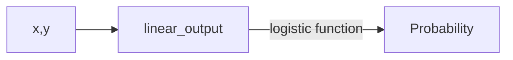

## The basic supervised learning framework

$$
y = f(x)
$$

- $y$: output
- $f$: prediction function
- $x$: input

training:

$$
{(x_1,𝑦1), …, (x_N,Y_N)}
$$

## Nearest neighbor classifier

$f(x)$ = label of the training example nearest to $x$

K-nearest neighbor classifier:

{: w="300"}

{: h="200"}

## Linear classifier

{: w="300"}

{: w="300"}

$$
f(x) = \operatorname{sgn} (w\cdot x + b)
$$

NN vs. linear classifiers: Pros and cons

NN pros:

- Simple to implement
- Decision boundaries not necessarily linear
- Works for any number of classes
- Nonparametric method
NN cons:
- Need good distance function
- Slow at test time
Linear pros:
- Low-dimensional parametric representation
- Very fast at test time
Linear cons:
- Works for two classes
- How to train the linear function?
- What if data is not linearly separable?

### Empirical loss minimization

define expected loss

$$
L(f)=\mathbb{E}_{(x, y) \sim D}[l(f, x, y)]
$$

- $0-1$ loss
  - $l(f,x,y) = \mathbb{I}[f(x) \neq y]$
  - $L(f)=\operatorname{Pr}[f(x) \neq y]$
- $l_2$ loss
  - $l(f, x, y)=[f(x)-y]^2$
  - $L(f)=\mathbb{E}\left[[f(x)-y]^2\right]$
  
Find $f$ that minimizes

$$
\hat{L}(f)=\frac{1}{n} \sum_{i=1}^n l\left(f, x_i, y_i\right)
$$

- for $0-1$ loss
  - NP-hard
  - use surrogate loss functions instead
- $l_2$ loss
  - $\hat{L}(f_w) = \frac{1}{n} \Vert Xw-Y \Vert_2$ is a convex function
  - $0 = \nabla \Vert Xw-Y \Vert_2 = 2X^T (Xw - Y)$
  - $w = (X^T X)^{-1} X^T Y$

### Interpretation of $l_2$ loss

Assumption:

$y$ is normally distributed with mean $f_w(x) = w^Tx+b$

Maximum likelihood estimation:

$$
\begin{aligned}
w_{ML} &= \arg\min_w - \sum_i \log P_w(y_i | x_i) \\
       &= \arg\min_w \sum_i - \log \left( \frac{1}{\sqrt{2\pi\sigma^2}} \exp\left( - \frac{[ y_i-f_w(x_i)]^2}{2\sigma^2} \right) \right) \\
       &= \arg\min_w \sum_i \log \sqrt{2\pi\sigma^2} + \frac{[y_i-f_w(x_i)]^2}{2\sigma^2} \\
       &= \arg\min_w \sum_i [y_i-f_w(x_i)]^2 \\
\end{aligned}
$$

### Problem of linear regression

{: w="500"}
_Linear regression is very sensitive to outliers_

## Logistic regression

use sigmoid function

$$
\sigma(x) = \frac{1}{1 + e^{-x}}
$$

{: w="300"}
_sigmoid function_

$$
P_w(y=1 | x)=\sigma\left(w^T x\right)=\frac{1}{1+\exp \left(-w^T x\right)}
$$

$$
P_w(y=-1 | x) = 1-P_w(y=1|x)=\sigma(-w^Tx)
$$

$$
\log \frac{P(y=1 \mid x)}{P(y=-1 \mid x)}=w^T x+b
$$

### Logistic loss

{: w="400" }

Maximum likelihood estimate:

$$\begin{aligned}
w_{ML} &= \arg\min_w \sum_i -\log P(y_i|x_i) \\
&= \arg\min_w \sum_i -\log \sigma(y_iw^Txi)
\end{aligned}
$$

i.e. the logistic loss

$$
l(w,x_i, y_i) := -\log \sigma(y_i  w^T x_i)
$$

### Gradient descent

To minimize $l(w,x_i, y_i)$, use gradient descent

$$
w \leftarrow w - \eta \nabla\hat{L} (w)
$$

### Stochastic gradient descent (SGD)

$$
w \leftarrow w - \eta \nabla l(w, x_i, y_i)
$$

mini-batch SGD:

$$
\nabla \hat{L}=\frac{1}{b} \sum_{i=1}^b \nabla l\left(w, x_i, y_i\right)
$$

$$
\begin{aligned}
\nabla l\left(w, x_i, y_i\right)&=-\nabla_w \log \sigma\left(y_i w^T x_i\right) \\
&=-\frac{\nabla_w \sigma\left(y_i w^T x_i\right)}{\sigma\left(y_i w^T x_i\right)} \\
&=-\frac{\sigma\left(y_i w^T x_i\right) \sigma\left(-y_i w^T x_i\right) y_i x_i}{\sigma\left(y_i w^T x_i\right)} \\
&= \boxed{-\sigma(-y_iw^Tx_i)y_ix_i}

\end{aligned}
$$

SGD:

$$
w \leftarrow w+\eta \sigma\left(-y_i w^T x_i\right) y_i x_i
$$

Logistic regression does not converge for linearly separable data:

_Scaling $w$ by ever larger constants makes the classifier more confident and keeps increasing the likelihood of the data_
