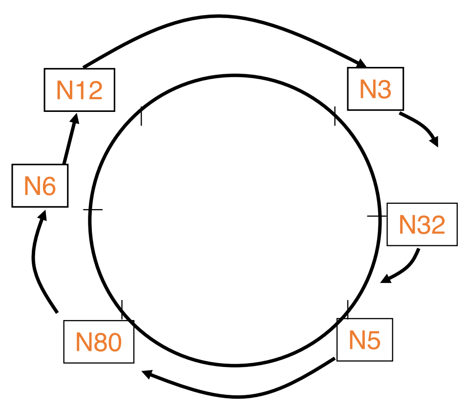
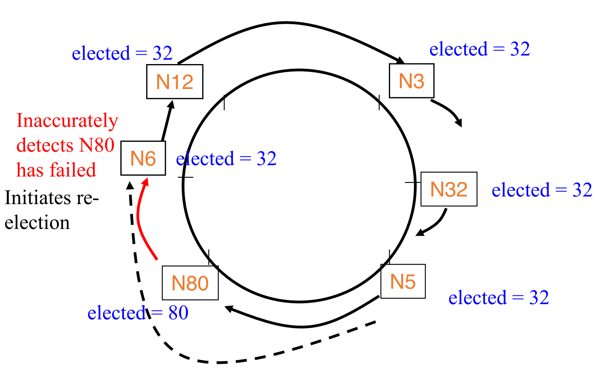
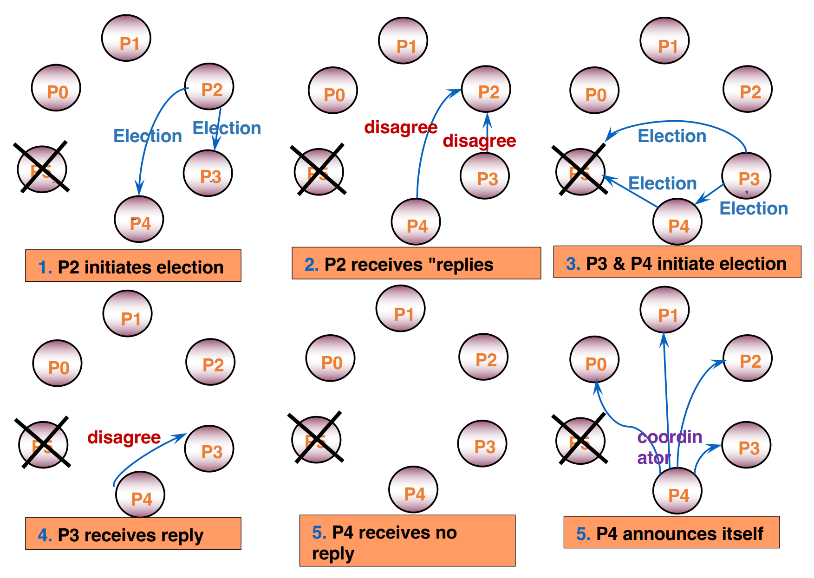

## Leader Election

- Any process can call for an election.
- A process can call for at most one election at a time.
- Multiple processes are allowed to call an election simultaneously.
  - All of them together must yield only a single leader
- The result of an election should not depend on which process
calls for it.

### Election Problem

A run of the election algorithm must always guarantee:

- **Safety**: For all non-faulty processes p:
  - p has elected:
    1) (q: a particular non-faulty process with the best attribute value)
    2) or Null
- **Liveness**: For all election runs:
  - election run terminates
  - for all non-faulty processes p: p’s elected is not Null

At the end of the election protocol, the non-faulty process with the
best (highest) election attribute value is elected.

## Classical Election Algorithms

### Ring election algorithm

- N processes are organized in a logical ring
- All messages are sent clockwise around the ring.

=400x
_Ring Election Protocol_

- When $P_i$ start election
  - send _election_ message with $P_i$ ’s $<attr_i, i>$ to ring successor.
  - set state to *participating*
- When $P_j$ receives message (_election_, $<attr_x, x>$ ) from predecessor
  - If $(attr_x, x) > (attr_j, j)$ :
    - forward message (_election_, $<attr_x, x>$ ) to successor
    - set state to *participating*
  - If $(attr_x, x)$ < $(attr_j, j)$ 
    - If (_not participating_):
      - send (_election_, $<attr_j, j>$ ) to successor
      - set state to *participating*
  - If $(attr_x, x)$ = $(attr_j, j)$ : $P_j$ is the elected leader (why?)
    - send elected message containing $P_j$ ’s id.
- elected message forwarded along the ring until it reaches the leader.
  - Set state to _not participating_ when an elected message is received.

#### Performance Analysis

- assume no failures occur during the election protocol itself, and there are $N$ processes.
  - assume that only one process initiates the algorithm
    - Bandwidth usage (total number of messages)
      - $O(N)$ : Worst case $= 3N -1$ ; Best case = $2N$ .
    - $O(N)$ turnaround time.
  - When each process initiates the algorithm:
    - $O(N)$ messages in best-case.
    - $O(N^2)$ messages in worst-case.
    - $O(N)$ turnaround time.

##### Handling Failures

- A process can detect failure of a process via its own local failure detector:
  - Repair the ring.
  - Stop forwarding  message on failed process
  - Start a new run of leader election.
- failure detectors cannot be both complete and accurate.
  - Incomplete FD: violation of liveness
  - Inaccurate FD: violation of safety.

=500x

### Bully algorithm

When a process wants to initiate an election:

- if it knows its id is the highest
  - it elects itself as coordinator
  - sends a Coordinator message to all processes with lower identifiers. Election is completed.
- else it initiates an election by sending an _Election_ message
  - Sends it to only processes that have a higher id than itself.
  - if receives no answer **within timeout**
    - calls itself leader and sends Coordinator message to all lower id processes. Election completed.
  - if an answer received however, then
    - there is some non-faulty higher process.
    - wait for coordinator message. If none received after **another timeout**, start a new election run.

A process that receives an _Election_ message replies with _disagree_ message,
and starts its own leader election protocol (unless it has already done so).

=600x

#### Timeout values

Assume the one-way message transmission time (T) is known.

- first timeout: 2T + (processing time) ≈ 2T

#### Performance Analysis

Best-case

- Turnaround time: 1 message transmission time (T)
  - if Highest remaining id initiates election.

Worst-case

- Turnaround time: 4 message transmission times (4T)
  - if any lower id process detects failure and starts election.
