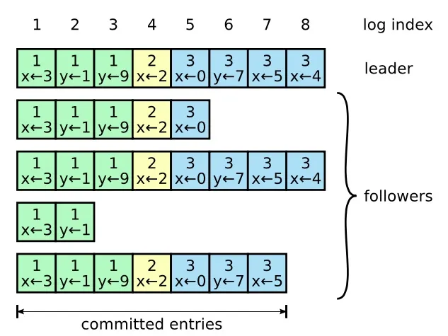

## Paxos

### Concepts

Proposal
: contains **value** and **number**

Proposal number:
: An global **unique** "id" of the proposal

Proposal value:
: the "content" of the proposal

3 types of roles:

Proposer
: propose values to acceptors.

Acceptors
: accept proposed values

Learners
: learns the value that has been accepted by **majority** of acceptors.
: **All** processes.

When a value v is accpected by a **majority** (> 50%) acceptors, then that value v becomes the decided value.

### Phase 1

#### Proposer

- sends `prepare` with a proposal nunmber n to a majority of acceptors.
- reurest acceptors to:
  - promise will not **respond** or **accept** to to any proposal with **a lower number**.

#### Acceptor

when recieving `prepare` with number n:

- if it have not **responded** to a `prepare` with **higher number**
  - reply `OK`
  - if have accpeted other value v with lower number m < n
    - attach v, m to the response

### Phase 2

#### Proposer

- if recived `OK` from majority of acceptors
  - if applicable, set proposal value v = the v with **highest proposal number** m among respondes
  - keep original v otherwise
  - send `accept` with v, n
- if does not hear from majority of acceptors
  - Wait for some time, and then issue a new request with higher
number

#### Acceptor

When receives an `accept` with number n:

- if have not responded a `prepare` with higher number
  - **accept** the proposal

### Proof

At time $t$, if a proposal $(n,v)$ is accepted by a majority $M$ of the acceptors, it means that all $A\in M$ have not responded to a higher $n'>n$ before acceptance.
Since any majority of the acceptors contains $\ge 1$ process that is in $M$, no $n'>n$ will be accepted before time $t$. And after $t$, $n$ is the highest proposal number and any majority will contain a acceptor in $M$, so any proposal collecting a majority of `OK` ends up having value $v$.

<!-- Any acceptor in M have not replied with higher proposal numbers -->

<!-- Assume an acceptor outside M have accpected a proposal with number n' > n, then this proposal is accepted by a majority (M') of the acceptors. For a acceptor in both M and M', it can not have accpeted n' first because it promise to not respond to n < n'. So it have acccpted n first.  -->

<!-- Assume an acceptor $A\in M$ accepted $(n, v)$ and another $A'\in M'$ accepted $(n' > n, v' \ne v)$.
Then for an acceptor $A_i \in M \cap M'$, it have replied to $n$ first and $n$

Then then  -->

## Raft

<!-- Paxos is for single value.

Sometimes needs a sequence of value (log).

Multi-Paxos
: run Paxos repeatedly for each log entry
: complex

Raft
: uses a leader
: each leader leads a **term**

### Leader election

Uses **heartbeat**: leader sends periodic hearbeat to followers.

When detecting leader crashed

- wait for a **random** period of time (timeout)
- **term++**, turn into candidate.
- **vote** for itself
- request other processes to **vote** for itself (each process can only vote once), with `RequestVote` RPC
- if won majority of votes
  - become leader, sends heartbeat to others
- else: **split vote** (no leader elected)
  - repeat

### Logging

Leader accepts requests from client and generates logs.

=200x

log entries contains: **index** and **term**

if 2 entries have same indices and terms, the sequence of log entries before them are the same.

The leader:

- Add log entry to log
- request `AppendEntries` RPC from followers.
- repeat until all followers completes

### Normal operation (basic log replication)

### Safety and consistency after leader changes -->

See <https://zhuanlan.zhihu.com/p/32052223>
