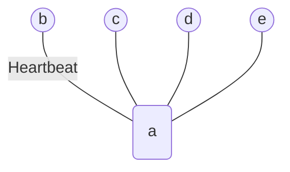
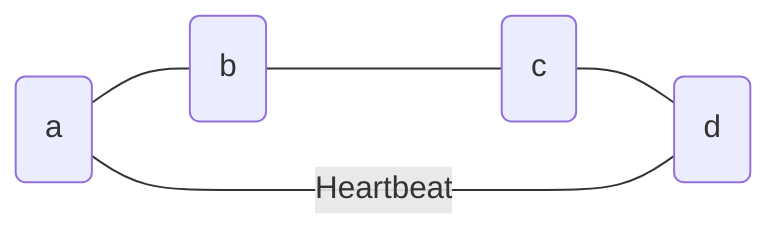
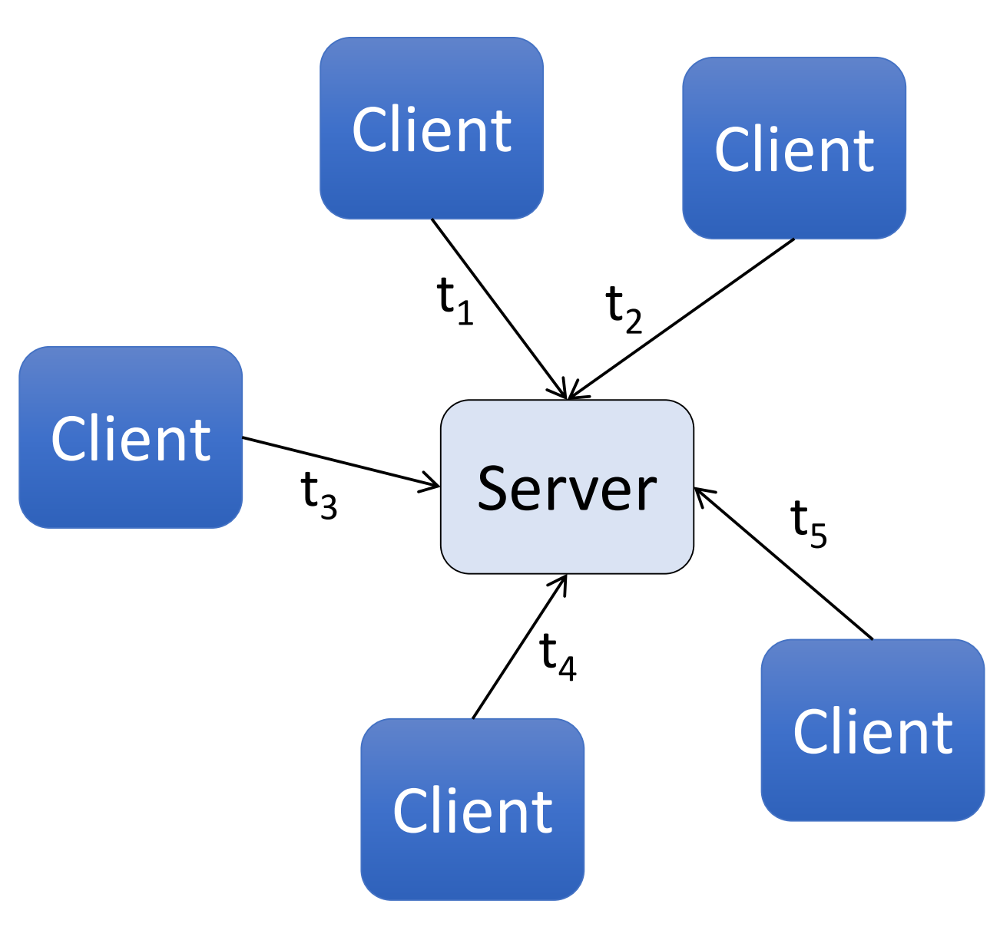
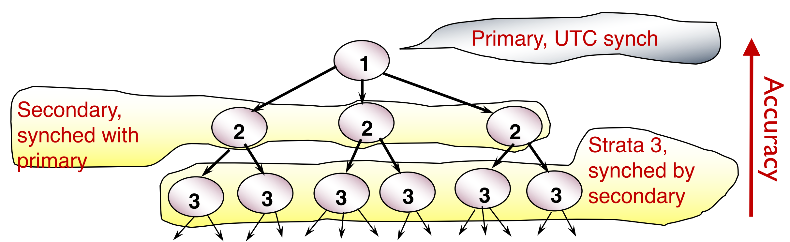
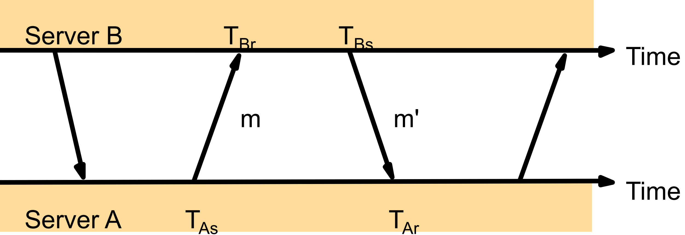

## Omission

- Omission: when a process or a channel fails to perform actions that it is supposed to do.
  - ping-ack or heartbeat
- Communication omission:
  - mitigated by network protocols.

### Extending heartbeats

Centralized heartbeating

Ring heartbeating

All-to-all heartbeats (All-to-all heartbeats)

Types of failure

- **Omission**: when a process or a channel fails to perform
actions that it is supposed to do, e.g. process crash and
message drops.
- **Arbitrary** (Byzantine) Failures: any type of error, e.g. a
  - process executing incorrectly, sending a wrong message, etc.
- **Timing** Failures: Timing guarantees are not met.
  - Applicable only in synchronous systems.

## Time and Clocks

### Clock Skew and Drift Rates

- **Clock skew**: relative difference between two clock values.
- **Clock drift rate**: change in skew from a perfect reference clock per
unit time (measured by the reference clock).

### forms of synchronization

- External synchronization
  - Synchronize time with an authoritative clock.
  - When accurate timestamps are required.

- Internal synchronization
  - Synchronize time internally between all processes in a distributed
  system.
  - When internally comparable timestamps are required.

### Synchronization Bound

Synchronization bound (D) between two clocks A and B over
a real time interval I:

- \|A(t) – B(t)\| < D, for all t in the real time interval I.
- If A is authoritative, D can also be called accuracy bound.

## Synchronization in asynchronous systems

### Cristian Algorithm

$$
T_{client}=T_{server}+\left(T_{round} / 2\right)
$$

then

$$
\text{skew} \le T_{\text {round }} / 2 - \min \le T_{\text {round }} / 2
$$

where $\min$ is minimum one way network delay.

### Berkeley Algorithm

=300x
_Berkeley Algorithm for internal synchronization_

1. Server periodically polls clients: “what time do you think it is?”
2. Each client responds with its local time.
3. Server uses **Cristian algorithm** to estimate local time at each client.
4. **Average** all local times (including its own) – use as updated time
5. Send the offset (amount by which each clock needs adjustment).

### NTP Symmetric Mode

=700x

- $T_{B r}$ and $T_{B s}$ are local timestamps at $B$ .
- $T_{A r}$ and $T_{A s}$ are local timestamps at $A$ .
- $t$ and $t’$ : actual transmission times for $m$ and $m’$ (unknown)
- $o$ : **true** offset of clock at B relative to clock at A
- $o_i$ : **estimate** of actual offset between the two clocks
- $d_i$ : **estimate** of accuracy of $o_i$ / total transmission times for $m$ and $m’$ . $d_i=t+t’$ 

=500x

relations:

$$
\begin{aligned}
& T_{Br}=T_{As}+t+o \\
& T_{Ar}=T_{Bs}+t'-o \\
& o=((T_{B r}-T_{A s})-(T_{A r}-T_{B s})+(t'-t)) / 2 \\
& o_{i}=((T_{Br}-T_{As})-(T_{Ar}-T_{Bs})) / 2 \\
& o=o_i+(t'-t) / 2 \\
& d_{i}=t+t'=(T_{Br}-T_{As})+(T_{Ar}-T_{Bs}) \\
& (o_i-d_i / 2) \leq 0 \leq(o_i+d_i / 2) \;\text { given } t, t' \geq 0
\end{aligned}
$$
