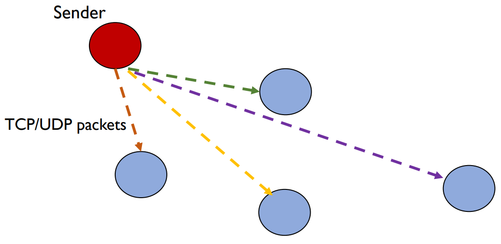
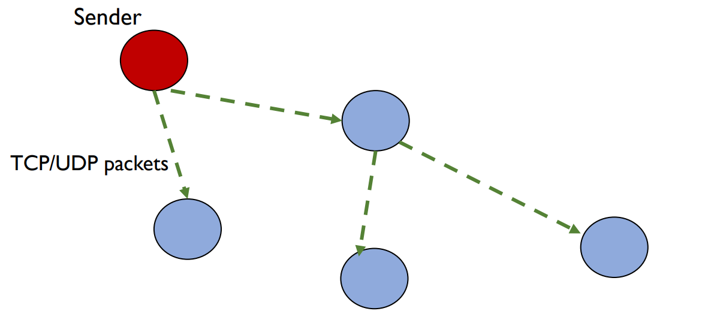
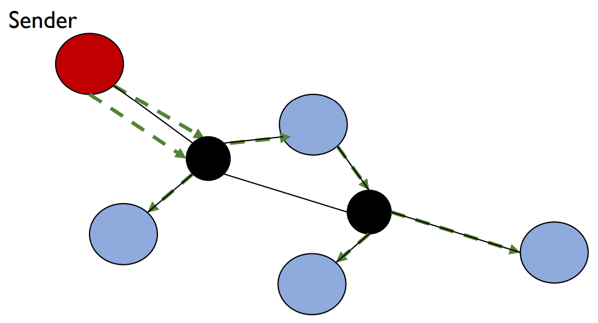
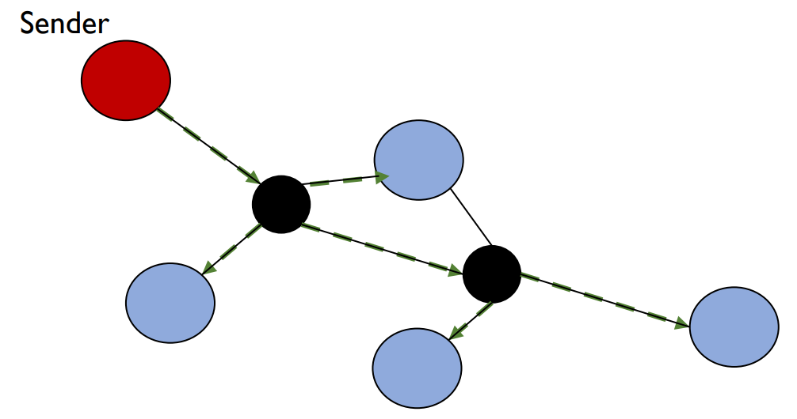
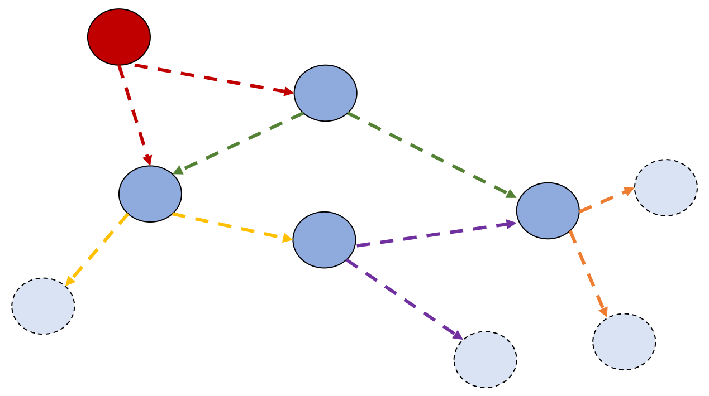
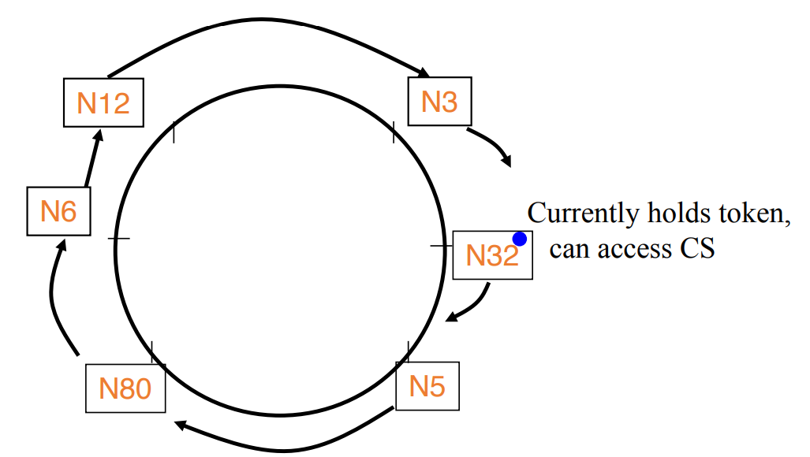

## More efficient B-multicasts

### B-multicast

{: w="500" }

in physical network view: Redundant packets

{: w="500" }

### Tree-based multicast

construct a minimum spanning tree and unicast along that.

{: w="500" }

then,

{: w="500" }

construct a tree that includes network routers.

{: w="500" }
_IP multicast_

### Third approach: Gossip

- Transmit to b random targets.
- Other nodes do the same when they receive a message.

Properties

- No "tree-construction" overhead.
- More efficient than unicasting to all receivers
- no hard guarantees.

{: w="500" }

## Mutual Exclusion

Classical algorithms for mutual exclusion in distributed systems:

- Central server algorithm
- Ring-based algorithm
- Ricart-Agrawala Algorithm
- Maekawa Algorithm

### prerequisites

- Safety (essential):
  - At most one process executes in CS (Critical Section) at any time.
- Liveness (essential):
  - Every request for a CS is granted eventually.
- Ordering (desirable):
  - Requests are granted in the order they were made.

### Central Server Algorithm

- Elect a central server (or leader)
- Leader keeps
  - A queue of waiting requests from processes who wish to access the CS
  - A special token which allows its holder to access CS
- Actions of any process in group:
  - enter()
    - Send a request to leader
    - Wait for token from leader
  - exit()
    - Send back token to leader

Leader:

- On receiving a request from process Pi
  - if (leader has token)
    - Send token to Pi
  - else
    - Add Pi to queue
- On receiving a token from process Pi
  - if (queue is not empty)
    - Dequeue head of queue (say Pj), send that process the token
  - else
    - Retain token

### Ring-based algorithm

the token travel around the ring.

{: w="500" }

- enter()
  - Wait until you get token
- exit() // already have token
  - Pass on token to ring successor
