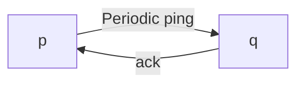

<https://courses.grainger.illinois.edu/ece428/sp2024//assets/slides/lect2-after.pdf>

## Key aspects of a distributed system

- Processes must **communicate** with one another to
coordinate actions. Communication time is variable.
- Different processes (on different computers) have **different clocks**.
- Processes and communication channels may **fail**.

## Relationship between processes

- Client-server
- Peer-to-peer

## Two ways to model

**Synchronous** distributed systems:

- **Known** upper and lower bounds on time taken by each step in a
process.
- **Known** bounds on message passing delays.
- **Known** bounds on [clock drift rates](https://en.wikipedia.org/wiki/Clock_drift).

**Asynchronous** distributed systems:

- **No bounds** on process execution speeds.
- **No bounds** on message passing delays.
- **No bounds** on clock drift rates.

## Types of failure

- Crash
- Fail-stop
- Communication omission

> Fail-stop failure is a type of failures that cause the component of a system experiencing this type of failure stops operating.
{: .prompt-tip }

## Detect a crashed process

p sends pings to q every $T$ seconds. $\Delta_1$ is the timeout value at p. If $\Delta_1$ time elapsed after sending ping, and no `ack`,
report q crashed.

- If synchronous, $\Delta_1$ = 2(max network delay)
- If asynchronous, $\Delta_1$ = (max observed round trip time)

q sends heartbeats to p every $T$ seconds. $(T + \Delta_2)$ is the timeout value at p. If $(T + \Delta_2)$ time elapsed since last heartbeat, report q crashed.

- If synchronous, $\Delta_2$ = max network delay – min network delay
- If asynchronous, $\Delta_2$ = k(observed delay)

## Correctness of failure detection

- **Completeness**: Every failed process is eventually detected.
- **Accuracy**: Every detected failure corresponds to a crashed process (no mistakes).

**Impossible** to achieve both completeness and accuracy.

## Metrics for failure detection

### Worst case failure detection time

Ping-ack:

$T + \Delta_1- \Delta$ where $\Delta$ is time taken for last ping from p to reach q

Heartbeat:

$\Delta + T + \Delta_2$ where $\Delta$ is time taken for last message from q to reach p

### Bandwidth usage

- Ping-ack: $2$ messages every $T$ units
- Heartbeat: $1$ message every $T$ units
