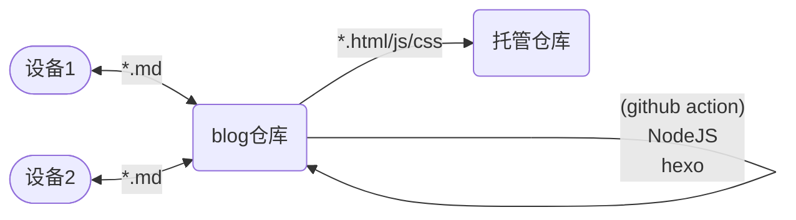
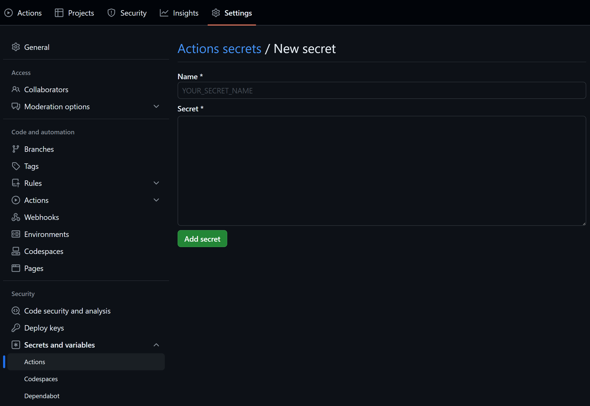
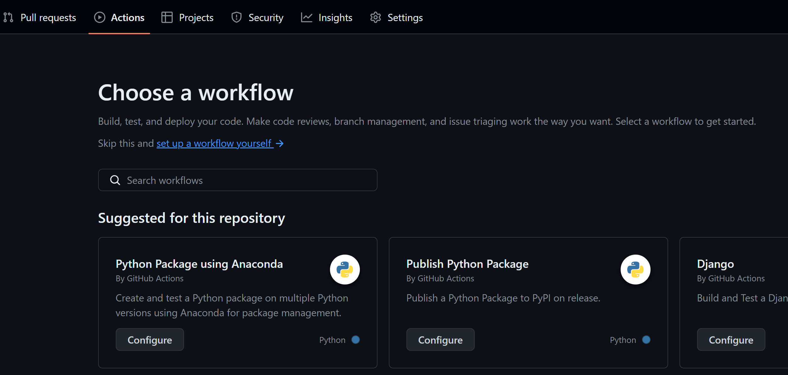
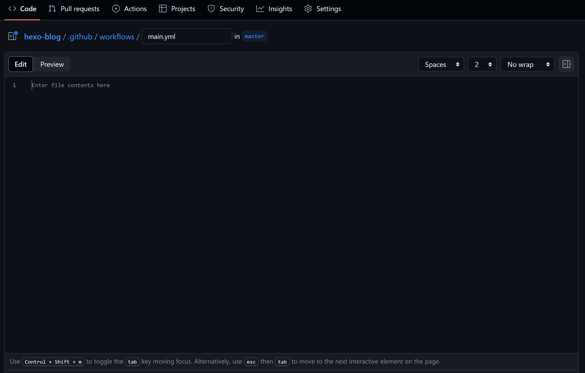

## github仓库

首先fork <https://github.com/hexojs/hexo-starter> ，这个仓库是 `hexo init` 创建hexo站点时的文件结构模板。下文把这个仓库叫做**blog仓库**，是站点的源代码（markdown）仓库。

创建 `<username>.github.io` 仓库，这是用作github pages静态托管（html）的仓库，下文把这个仓库叫做**托管仓库**。

### 流程

不同设备的只需要和blog仓库进行markdown源码同步，而不需要NodeJS环境：



因为 `hexo deploy` 会自动 `push` 到托管仓库，就需要运行在blog仓库中的github action有 `push` 到托管仓库的权限，这里使用ssh key实现。

## SSH key

在本地生成一对ssh公钥和私钥：

```shell
ssh-keygen -f <keyname>
```

### 私钥

私钥存在blog仓库中。私钥不能公开，所以使用github仓库的Repository secrets功能，作为一个私密变量给github action读取。

进入仓库的 `Settings > Repository secrets > Secrets and variables > Actions > Repository secrets > New repository secret`，创建一个私密变量，比如名叫`private_key`，并且粘贴私钥内容。



### 公钥

在托管仓库中，设置公钥使blog仓库有push的权限：

在仓库的`Settings > Deploy keys > Add deploy key` 粘贴公钥内容，Name随意。


## github action脚本

在blog仓库 `Actions > New Workflow > set up a workflow yourself` 创建一个空白的workflow：





写入脚本[^1] (修改用户名和email字段，`secrets.private_key` 需要之前储存私钥的变量名相同)

```yaml
name: Hexo Deploy
on:
  push:
   branches:
     - master
jobs:
  build:
   runs-on: ubuntu-latest
   steps:
     - name: Checkout source
       uses: actions/checkout@v4
       with:
         ref: master
     - name: Use Node.js 20.x
       uses: actions/setup-node@v4
       with:
         node-version: '20.x'
     - name: Setup hexo
       env:
         ACTION_DEPLOY_KEY: ${{ secrets.private_key }}
       run: |
        mkdir -p ~/.ssh/
        echo "$ACTION_DEPLOY_KEY" > ~/.ssh/id_rsa
        chmod 600 ~/.ssh/id_rsa
        ssh-keyscan github.com >> ~/.ssh/known_hosts
        git config --global user.email "<your email>"
        git config --global user.name "<your username>"
        npm install hexo-cli -g
        npm install hexo-deployer-git --save
        npm install
     - name: Node and Hexo version
       run: |
        node -v
        hexo -v
     - name: Hexo deploy
       run: |
        hexo clean
        hexo generate
        hexo deploy
```

如果需要增加npm包，可以在 `package.json` 中添加依赖，或者直接在workflow脚本中添加 `npm install <package>`。

## 完成

启动托管仓库的github page即可。

[^1]: 脚本修改自[这里](https://makefile.so/2021/11/28/use-github-actions-to-deploy-hexo-blog/)
