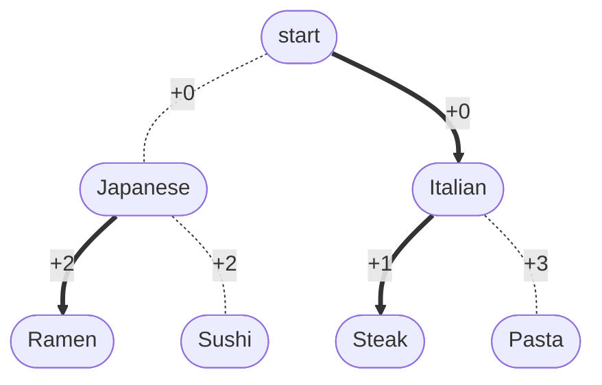
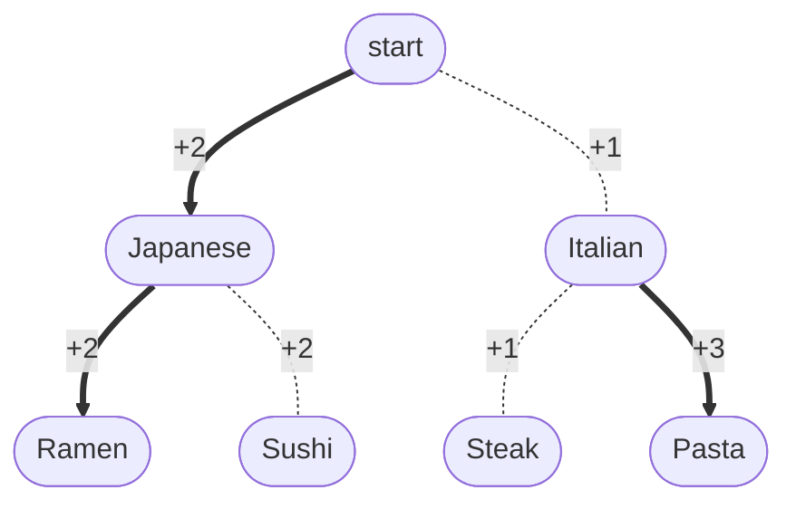
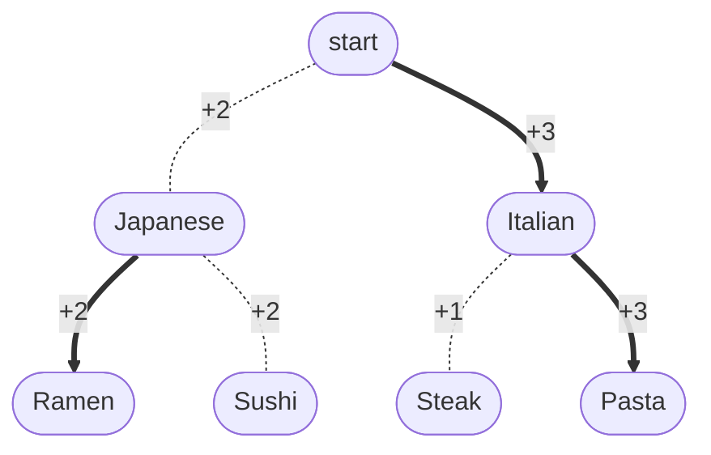

## Policy Iteration

$$
\pi_0: S \to A
$$

steps:

- policy evaluation: Compute $Q^{\pi_{k-1}}\in \mathbb{R}^{SA}$ 
- policy improvement: $\pi_k \leftarrow \pi_{Q^{\pi_{k-1}}}$ where

$$
\pi_{f{s}} = \argmax_{a \in A} f(s,a)
$$

property:

$$
\pi^\star \to Q^{\pi^\star }=Q^\star \to \pi_{Q^\star } =\pi^\star 
$$

> this means, once reached goal $\pi^\star$ , never leave.
{: .prompt-tip }

## example


Optimal policy is heading `Pasta`.

> This example is a finite horizon case.
> To make it infinite horizon discount, add a state $T$ :
>
> ```mermaid
> graph TD;
>     A([start])
>     A -->|+0| B([Japanese])
>     A -->|+0| C([Italian])
>     B -->|+2| D([Ramen])
>     B -->|+2| E([Sushi])
>     C -->|+1| F([Steak])
>     C -->|+3| G([Pasta])
> 
>     D -.->|+0| T((T))
>     E -.->|+0| T((T))
>     F -.->|+0| T((T))
>     G -.->|+0| T((T))
>     T --->|+0| T((T))
> ```
>
{: .prompt-tip }

To find $V^\star (s)$ , update $V$ value from leaf upwards to root state.

### policy iteration (example)

#### interation #0

define initial $\pi_0$ :



then the corresponding $Q^{\pi_0} (s, a)$ :


#### interation #1

$$
\pi_1(s) := \argmax_{a\in A} Q^{\pi_0} (s, a)
$$



$Q^{\pi_i}$:


#### interation #2

$$
\pi_2(s) := \argmax_{a\in A} Q^{\pi_1} (s, a)
$$



#### Comment

Policy $\pi$ was switched to Japanese for once, and switched back to Italian at the end.

Also, the policy updates upwards.

## Monotone Policy improvement

$$
\forall k,\forall s: V^{\pi_k}\geq V^{\pi_{k-1}}
$$

$$
\text { if } \pi_{k-1} \neq \pi^\star , \exists s: v^{\pi_k}(s)>V^{\pi_{k-1}}(s)
$$

$$
\Rightarrow \text{\#iteration} \le |A|^{|S|}
$$

>  Monotone Policy improvement produces exact solutions, while value iteration produces approxmitate solutions,
{: .prompt-tip }

Proof of: $Q^{\pi_{k+1}} \ge Q^{\pi_k}$ 

lemma 1:

$$
Q^{\pi_k}=\mathcal{T}^{\pi_k} Q^{\pi_k} \leq \mathcal{T} Q^{\pi_k}
$$

beacuse

$$
\begin{aligned}
& (\mathcal{T}^\pi f)(s, a)=R(s, a)+\gamma \mathbb{E}_{s^{\prime} \sim p(\cdot \mid s, a)}\left[f\left(s^{\prime}, \pi\right)\right] \\ \le
& (\mathcal{T} f)(s, a)=R(s, a)+\gamma \mathbb{E}_{s^{\prime} \sim  p(\cdot \mid s, a)}\left[\max _{a^{\prime}} f\left(s^{\prime}, a^{\prime}\right)\right]
\end{aligned}
$$

lemma 2:

$$
\mathcal{T} Q^{\pi_k}=\mathcal{T}^{\pi_{k+1}} Q^{\pi_k}
$$

lemma 3:

$$
\forall f \ge f', \; \mathcal{T}^\pi f \ge \mathcal{T}^\pi f'
$$

with lemma 1,2,3,

$$
\begin{aligned}
Q^{\pi_k} & \leq \boxed{\mathcal{T}^{\pi_{k+1}} Q^{\pi_k}} \\
\Rightarrow  \boxed{\mathcal{T}^{\pi_{k+1}} Q^{\pi_k}} & \leq \mathcal{T}^{\pi_{k+1}} \mathcal{T}^{\pi_{k+1}} Q^{\pi_k} \\
& \vdots \\
\Rightarrow  Q^{\pi_k} & \leq\left(\mathcal{T}^{\pi_{k+1}}\right)^{\infty} Q^{\pi_k}=Q^{\pi_{k+1}}
\end{aligned}
$$

because $Q^{\pi_{k+1}}$ is the fixed point of $\mathcal{T}^{\pi_{k+1}}$ .